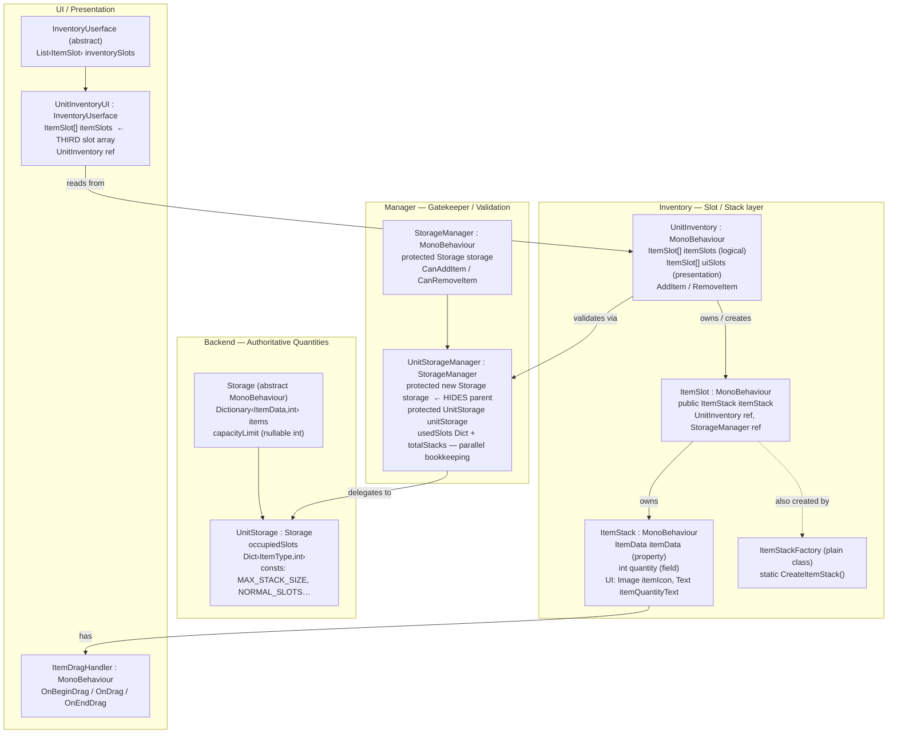

# Moonlight RTS — Inventory / Item System Audit

---

## 1. ARCHITECTURE



### Key observation

There are **four independent slot/item-count authorities**:

| Authority | Location | Representation |
|---|---|---|
| 1. Backend quantities | `Storage.items` (`Dictionary<ItemData,int>`) | Summed quantities per ItemData |
| 2. Backend slot counts | `UnitStorage.occupiedSlots` (`Dictionary<ItemType,int>`) | Slot count per type |
| 3. Manager slot counts | `UnitStorageManager.usedSlots` + `totalStacks` | Parallel slot count per type + total quantity |
| 4. Stack quantities | `ItemStack.quantity` (field on MonoBehaviour) | Per-stack quantity |

None of these are kept in sync by any transactional mechanism.

---

## 2. VERIFIED FINDINGS

### A. ItemSlot.Awake executes immediately on AddComponent, before UnitInventory assigns references

**CONFIRMED**

Unity guarantees `Awake()` fires synchronously during `AddComponent<T>()`. In [`UnitInventory.CreateNewItemSlot()`](file:///e:/GitHub/Moonlight/Assets/Scripts/Item%20System/Inventory/UnitInventory.cs#L316):

```csharp
ItemSlot slot = slotGO.AddComponent<ItemSlot>();   // L316 — Awake fires HERE
slot.unitInventory = this;                          // L319 — too late
slot.storageManager = unitStorageManager;            // L322 — too late
```

Inside [`ItemSlot.Awake()`](file:///e:/GitHub/Moonlight/Assets/Scripts/Item%20System/Userface/ItemSlot.cs#L84-L121):
- L94: `GetComponentInChildren<ItemStack>()` — returns null (no child yet).
- L97: Falls through to `ItemStackFactory.CreateItemStack(transform)` — creates a **premature** ItemStack with UI components.
- L101: `GetComponentInParent<UnitStorageManager>()` — **this will actually succeed** because the slot GO is parented to the unit (L295 in `CreateSlotGameObject`), and the unit has `[RequireComponent(typeof(UnitStorageManager))]`. So `storageManager` gets set by Awake, then overwritten at L322.
- L113: `GetComponentInParent<UnitInventoryUI>()` — returns null (logical slots are not under Canvas).
- L116–119: `IsItemStackSetup()` runs, tries to re-resolve unitInventoryUI, gets null, logs error, returns false.

**Net effect**: ItemSlot.Awake creates a premature ItemStack via factory, then `CreateNewItemSlot` creates a **second** ItemStack at L331 and assigns it at L344, orphaning the first one.

---

### B. ItemSlot.Awake searches for ItemStack child, logs error if absent, making later creation unreachable

**REJECTED** — the current code does **not** match the hypothesis.

The commented-out code at [L86–L92](file:///e:/GitHub/Moonlight/Assets/Scripts/Item%20System/Userface/ItemSlot.cs#L86-L92) is the version that would log-error-and-return. The **active** code at [L94–L98](file:///e:/GitHub/Moonlight/Assets/Scripts/Item%20System/Userface/ItemSlot.cs#L94-L98) instead falls through to `ItemStackFactory.CreateItemStack()` when no child is found:

```csharp
itemStack = GetComponentInChildren<ItemStack>();    // L94
if (itemStack == null)                               // L95
{
    itemStack = ItemStackFactory.CreateItemStack(transform);  // L97 — creates one
}
```

The fallback is **reachable** and **does execute**. The bug is the opposite: it creates a stack too eagerly, which then gets orphaned.

---

### C. Intended invariant: ItemSlot always owns one persistent ItemStack; empty = null data + quantity 0; itemStack == null = structural failure

**PARTIALLY CONFIRMED**

Evidence **for** the intended invariant:
- [UnitStorage notes L21–L36](file:///e:/GitHub/Moonlight/Assets/Scripts/Item%20System/Storages/UnitStorage.cs#L21-L36): "STACKS ARE WHAT SLOTS SETS ITEMS INTO… STACK CAN ONLY BE OF ONE TYPE"
- [ItemSlot TODO L616–L619](file:///e:/GitHub/Moonlight/Assets/Scripts/Item%20System/Userface/ItemSlot.cs#L616-L619): "Just clear it, removing a Stack or Slot is too tedious… when we eventually will fill it anyway"
- `ItemStack.HasItem()` returns `itemData != null` — designed around data-nullity, not stack-nullity.
- `CreateNewItemSlot` creates a stack with `SetItemData(null, 0)` — empty-but-present.

Evidence **against**: `ClearSlot()` and `CheckAndClearSlotIfEmpty()` both set `itemStack = null`, directly contradicting this. The comment at [L593](file:///e:/GitHub/Moonlight/Assets/Scripts/Item%20System/Userface/ItemSlot.cs#L593) `// keep itemStack for reuse.` was written as intent, but the immediately preceding line does `itemStack = null`, nullifying that intent. This is a **code/comment contradiction**.

**Verdict**: The invariant is *intended* but *violated* by at least two methods.

---

### D. ItemStack.Start dereferences itemSlot before checking it

**CONFIRMED**

[`ItemStack.Start()`](file:///e:/GitHub/Moonlight/Assets/Scripts/Item%20System/Item%20Code/ItemStack.cs#L35-L79):

```csharp
private void Start()
{
    itemSlot.storageManager?.GetComponent<Item>();   // L37 — dereference BEFORE null check
    if (itemSlot == null)                             // L38 — null check AFTER
    {
        Debug.LogError("ItemStack: itemSlot is null.");
        return;
    }
```

Line 37 will throw `NullReferenceException` if `itemSlot` is null. The null check at L38 is dead code in that scenario. Furthermore, `itemSlot` is a `{ get; private set; }` property that is **never assigned** during the normal `CreateNewItemSlot` flow — `slot.itemStack = stack` is set, but `stack.SetItemSlot(slot)` is never called. So `itemSlot` is **always null** for programmatically created stacks.

> [!CAUTION]
> This is a guaranteed `NullReferenceException` at runtime for every programmatically created ItemStack.

---

### E. ItemStack UI references uninitialized when SetItemData/UpdateStackUI executes

**CONFIRMED**

`itemIcon` and `itemQuantityText` are assigned in `Start()` at [L61–L74](file:///e:/GitHub/Moonlight/Assets/Scripts/Item%20System/Item%20Code/ItemStack.cs#L61-L74). But `SetItemData(ItemData, int)` is called from `CreateNewItemSlot` at [L337](file:///e:/GitHub/Moonlight/Assets/Scripts/Item%20System/Inventory/UnitInventory.cs#L337) during `Awake`, which is **before `Start`** runs. `SetItemData` calls `UpdateStackUI` at [L161](file:///e:/GitHub/Moonlight/Assets/Scripts/Item%20System/Item%20Code/ItemStack.cs#L161), which accesses `itemIcon` and `itemQuantityText`.

The `UpdateStackUI` method has null-guards ([L340, L349](file:///e:/GitHub/Moonlight/Assets/Scripts/Item%20System/Item%20Code/ItemStack.cs#L340-L355)) that log errors but don't crash. So the UI update **silently fails** rather than throwing.

For stacks created by `ItemStackFactory.CreateItemStack()`, UI components *are* initialized via `InitializeUIComponents(icon, text)` at [L44](file:///e:/GitHub/Moonlight/Assets/Scripts/Item%20System/Userface/ItemSlot.cs#L44), but those stacks get orphaned (see finding A).

---

### F. SetItemData(ItemData, int) accepts quantity but fails to assign it

**CONFIRMED**

[`ItemStack.SetItemData(ItemData data, int quantity)`](file:///e:/GitHub/Moonlight/Assets/Scripts/Item%20System/Item%20Code/ItemStack.cs#L157-L162):

```csharp
public void SetItemData(ItemData data, int quantity)
{
    itemData = data;           // L159 — assigns data
                               // MISSING: this.quantity = quantity;
    UpdateStackUI(quantity);   // L161 — passes quantity to UI but never stores it
}
```

The `quantity` parameter shadows the field `this.quantity` and is used only as a display argument to `UpdateStackUI`. The actual `this.quantity` field **remains at its prior value** (default 0 for new stacks). This means every call to `SetItemData(data, qty)` shows the right number in UI text but the underlying quantity is wrong.

> [!CAUTION]
> This is a critical data-corruption bug. All code paths that call `SetItemData(data, qty)` believing they set the quantity are wrong: [`CreateNewItemSlot` L337](file:///e:/GitHub/Moonlight/Assets/Scripts/Item%20System/Inventory/UnitInventory.cs#L337), [`CreateItemStackInSlot` L468](file:///e:/GitHub/Moonlight/Assets/Scripts/Item%20System/Inventory/UnitInventory.cs#L468), [`PopulateItemSlots` L101](file:///e:/GitHub/Moonlight/Assets/Scripts/Item%20System/Inventory/UnitInventory.cs#L101), [`ItemSlot.SetItemData` L132](file:///e:/GitHub/Moonlight/Assets/Scripts/Item%20System/Userface/ItemSlot.cs#L132), [`SwapItems` L582-L583](file:///e:/GitHub/Moonlight/Assets/Scripts/Item%20System/Userface/ItemSlot.cs#L582-L583), [`HandleItemDrop` L570](file:///e:/GitHub/Moonlight/Assets/Scripts/Item%20System/Userface/ItemSlot.cs#L570), [`ReceiveDroppedItem` L750](file:///e:/GitHub/Moonlight/Assets/Scripts/Item%20System/Userface/ItemSlot.cs#L750).

---

### G. ItemStack creation responsibility is duplicated, producing partially initialized or duplicate stacks

**CONFIRMED**

ItemStack creation occurs in at least **four** independent locations:

| Creator | File:Line | When |
|---|---|---|
| `ItemSlot.Awake` | [ItemSlot.cs L97](file:///e:/GitHub/Moonlight/Assets/Scripts/Item%20System/Userface/ItemSlot.cs#L97) | via `ItemStackFactory.CreateItemStack()` |
| `ItemSlot.Awake → IsItemStackSetup` | [ItemSlot.cs L207–L237](file:///e:/GitHub/Moonlight/Assets/Scripts/Item%20System/Userface/ItemSlot.cs#L207-L237) | factory or prefab instantiation |
| `UnitInventory.CreateNewItemSlot` | [UnitInventory.cs L325–L331](file:///e:/GitHub/Moonlight/Assets/Scripts/Item%20System/Inventory/UnitInventory.cs#L325-L331) | manual `AddComponent<ItemStack>()` |
| `UnitInventory.CreateItemStackInSlot` | [UnitInventory.cs L450–L453](file:///e:/GitHub/Moonlight/Assets/Scripts/Item%20System/Inventory/UnitInventory.cs#L450-L453) | manual `AddComponent<ItemStack>()` |
| `ItemSlot.SetItemData` | [ItemSlot.cs L128–L131](file:///e:/GitHub/Moonlight/Assets/Scripts/Item%20System/Userface/ItemSlot.cs#L128-L131) | creates GO + `AddComponent<ItemStack>()` |
| `ItemSlot.ReceiveDroppedItem` | [ItemSlot.cs L732–L733](file:///e:/GitHub/Moonlight/Assets/Scripts/Item%20System/Userface/ItemSlot.cs#L732-L733) | prefab instantiation |

Each creator initializes a different subset of fields. None calls `stack.SetItemSlot(slot)`. The factory version adds UI components; the manual version doesn't. This guarantees partially-initialized stacks.

---

### H. ClearSlot and CheckAndClearSlotIfEmpty nullify itemStack, contradicting persistent-stack design

**CONFIRMED**

[`ItemSlot.ClearSlot()`](file:///e:/GitHub/Moonlight/Assets/Scripts/Item%20System/Userface/ItemSlot.cs#L756-L767):
```csharp
itemStack.ClearStack();   // L760 — clears data
itemStack = null;          // L762 — destroys reference
```

[`ItemSlot.CheckAndClearSlotIfEmpty()`](file:///e:/GitHub/Moonlight/Assets/Scripts/Item%20System/Userface/ItemSlot.cs#L588-L595):
```csharp
itemStack.ClearStack();   // L592
itemStack = null;          // L593 — comment says "keep itemStack for reuse" but code nullifies it
```

Additionally, `ClearSlot` calls `UpdateSlotUI(0)` at L764, which accesses `itemStack.itemData` — but `itemStack` was just set to null at L762, causing **NullReferenceException** on L644.

[`UseItem()`](file:///e:/GitHub/Moonlight/Assets/Scripts/Item%20System/Userface/ItemSlot.cs#L597-L608) calls `CheckAndClearSlotIfEmpty()` at L601 (which may null out itemStack), then at L604 accesses `itemStack.GetQuantity()` — another **NullReferenceException**.

---

### I. GetSlot(itemData, quantity) does not verify matching ItemData before selecting a non-empty stack

**CONFIRMED**

[`UnitInventory.GetSlot(ItemData, int)`](file:///e:/GitHub/Moonlight/Assets/Scripts/Item%20System/Inventory/UnitInventory.cs#L603-L624):

```csharp
if (slot != null && slot.CanHoldItemType(itemData.type) && (slot.itemStack == null || !slot.IsSlotFull()))
{
    return slot;   // L620
}
```

This checks:
1. ✅ Slot not null
2. ✅ Compatible ItemType
3. ✅ Stack is null OR not full

It does **not** check whether the existing stack's `itemData` matches the incoming `itemData`. A slot containing "Wood" (type Normal, not full) would be returned for "Iron" (type Normal). This would cause `InitializeOrUpdateItemStack` to **overwrite** the Wood data with Iron data via `UpdateItemData`, corrupting the existing stack.

---

### J. UnitInventory.AddItem mutates ItemStack.quantity but may skip backend AddItem

**CONFIRMED**

The `AddItem` flow in [`UnitInventory.AddItem`](file:///e:/GitHub/Moonlight/Assets/Scripts/Item%20System/Inventory/UnitInventory.cs#L360-L437):

1. L536: `ValidateAndAddItem` calls `unitStorageManager.CanAddItem()` — **validation only**
2. L542: `slot.itemStack.AddQuantity(amount)` — mutates stack quantity
3. **Missing**: No call to `unitStorageManager.AddItem()` or `unitStorage.AddItem()`

The backend `Storage.items` dictionary is **never updated** by this path. The only validation call is `CanAddItem`, which is a read-only check. The stack quantity diverges from the storage dictionary immediately.

> [!CAUTION]
> This is the primary data desync bug. ItemStack quantities grow while `Storage.items` stays empty/stale.

---

### K. UnitStorage.occupiedSlots increments per AddItem call, not per stack creation

**CONFIRMED**

[`UnitStorage.AddItem`](file:///e:/GitHub/Moonlight/Assets/Scripts/Item%20System/Storages/UnitStorage.cs#L104-L124):

```csharp
public override void AddItem(ItemData itemData, int quantity)
{
    if (CanAddSpecificItem(itemData, quantity))
    {
        base.AddItem(itemData, quantity);            // adds to dictionary
        switch (itemData.type)
        {
            case ItemType.Normal:
                occupiedSlots[ItemType.Normal]++;     // L113 — increments EVERY call
```

If you add 5 units of Wood in one call, then 3 more Wood in another call, `occupiedSlots[Normal]` becomes 2, even though only one slot is in use. The check at L137 `occupiedSlots[Normal] + 1 > NORMAL_SLOTS` will reject items after 4 AddItem calls regardless of actual slot count.

Similarly, [`RemoveItem`](file:///e:/GitHub/Moonlight/Assets/Scripts/Item%20System/Storages/UnitStorage.cs#L164-L182) decrements once per call, so partial removals corrupt the count further.

---

### L. UnitStorageManager maintains parallel usedSlots/totalStacks alongside UnitStorage's occupiedSlots

**CONFIRMED**

[`UnitStorageManager`](file:///e:/GitHub/Moonlight/Assets/Scripts/Item%20System/Manager/UnitStorageManager.cs#L79-L85) has:
- `usedSlots` — `Dictionary<ItemType, int>` (L80)
- `totalStacks` — `int` (L79)

[`UnitStorage`](file:///e:/GitHub/Moonlight/Assets/Scripts/Item%20System/Storages/UnitStorage.cs#L80-L84) has:
- `occupiedSlots` — `Dictionary<ItemType, int>` (L80)

Both are independently incremented/decremented in their respective `AddItem`/`RemoveItem` overrides. The manager calls `unitStorage.AddItem()` at [L100](file:///e:/GitHub/Moonlight/Assets/Scripts/Item%20System/Manager/UnitStorageManager.cs#L100), which triggers UnitStorage's own increment. Then the manager increments its own at [L105](file:///e:/GitHub/Moonlight/Assets/Scripts/Item%20System/Manager/UnitStorageManager.cs#L105). Two counters, no reconciliation.

Additionally, `totalStacks += quantity` at [L112](file:///e:/GitHub/Moonlight/Assets/Scripts/Item%20System/Manager/UnitStorageManager.cs#L112) treats `totalStacks` as total **item quantity**, not stack count, despite the name.

---

### M. UnitStorageManager hides StorageManager.storage with `protected new Storage storage`

**CONFIRMED**

[`UnitStorageManager` L9](file:///e:/GitHub/Moonlight/Assets/Scripts/Item%20System/Manager/UnitStorageManager.cs#L9):
```csharp
protected new Storage storage; // This hides the inherited field
```

[`StorageManager` L8](file:///e:/GitHub/Moonlight/Assets/Scripts/Item%20System/Manager/StorageManager.cs#L8):
```csharp
protected Storage storage;
```

**Runtime consequences**:

1. `StorageManager.Awake()` at [L17–L23](file:///e:/GitHub/Moonlight/Assets/Scripts/Item%20System/Manager/StorageManager.cs#L17-L23) assigns `storage = GetComponent<Storage>()` — this sets the **parent's** `storage` field.
2. `UnitStorageManager.Awake()` at [L20–L41](file:///e:/GitHub/Moonlight/Assets/Scripts/Item%20System/Manager/UnitStorageManager.cs#L20-L41) does NOT assign the child's `storage` field. It only assigns `unitStorage`.
3. The child's `storage` field (the hiding one) remains **null**.
4. Any inherited method from `StorageManager` that references `storage` (e.g., `CanAddItem` at [StorageManager L43–L47](file:///e:/GitHub/Moonlight/Assets/Scripts/Item%20System/Manager/StorageManager.cs#L43-L47)) will access the **parent's** `storage` field (which was set by `StorageManager.Awake`).
5. However, `UnitStorageManager.CanAddItem` calls `base.CanAddItem` which accesses `storage.HasReachedCapacity()` — this uses the parent's field, which is `UnitStorage` (since it's the concrete `Storage` on the GO). So it *happens* to work because `StorageManager.Awake` resolves the correct component, and C# field hiding means the parent's methods still see the parent's field.

**The hiding is confusing but accidentally non-fatal** in the current code because `UnitStorageManager` uses `unitStorage` directly for its operations, while inherited methods use the parent's `storage` which gets set correctly.

---

### N. UnitStorageManager creates UnitStorage with `new UnitStorage()` — violating MonoBehaviour lifecycle

**CONFIRMED**

[`UnitStorageManager.Awake()` L27](file:///e:/GitHub/Moonlight/Assets/Scripts/Item%20System/Manager/UnitStorageManager.cs#L27):
```csharp
unitStorage = new UnitStorage(); // Or some other way to initialize it properly
```

`UnitStorage` extends `Storage` extends `MonoBehaviour`. Calling `new` on a MonoBehaviour:
- Does **not** attach it to any GameObject
- Triggers a Unity warning: "You are trying to create a MonoBehaviour using the 'new' keyword"
- The resulting object **cannot** have `Awake()` or `Start()` called
- Its `SetCapacityLimit` call in `UnitStorage.Awake()` never fires
- Any `GetComponent` calls on it will fail

This fallback path executes when `GetComponent<UnitStorage>()` returns null, i.e., when UnitStorage is not on the same GameObject. Given `[RequireComponent(typeof(UnitStorage))]` on `UnitInventory`, this should not normally happen, but the code path is still reachable (e.g., if UnitStorageManager is instantiated from a prefab separately).

---

### O. Storage.capacityLimit is quantity-based while UnitStorage supplies a slot count — semantic mismatch

**CONFIRMED**

[`Storage.HasReachedCapacity(int quantityToAdd)`](file:///e:/GitHub/Moonlight/Assets/Scripts/Item%20System/Storages/Storage.cs#L27-L41):
```csharp
int currentTotalQuantity = 0;
foreach (var entry in items)
{
    currentTotalQuantity += entry.Value;     // sums ALL item quantities
}
return currentTotalQuantity + quantityToAdd > capacityLimit;
```

[`UnitStorage.Awake()`](file:///e:/GitHub/Moonlight/Assets/Scripts/Item%20System/Storages/UnitStorage.cs#L73-L77):
```csharp
this.SetCapacityLimit(NORMAL_SLOTS + ABILITY_SLOT + CONSUME_SLOT); // = 6
```

So `capacityLimit = 6` is treated as a **total item count limit** (e.g., 6 items total across all slots), but the intent is 6 **slots**. With a MAX_STACK_SIZE of 40, the unit should hold up to 240 items, but `HasReachedCapacity` will reject anything beyond 6 total items.

This directly impacts `StorageManager.CanAddItem()` → `base.CanAddItem()` in `UnitStorageManager.CanAddItem()` at [L130](file:///e:/GitHub/Moonlight/Assets/Scripts/Item%20System/Manager/UnitStorageManager.cs#L130).

> [!CAUTION]
> The unit inventory will appear full after adding more than 6 items total, regardless of how many slots/stacks are available.

---

### P. UnitInventory.itemSlots vs UnitInventoryUI itemSlots — intentional or accidental duplication?

**PARTIALLY CONFIRMED — Intentionally separate, but implementation is confused**

Evidence for **intentional separation**:

- [UnitInventory.cs comments L8–L16](file:///e:/GitHub/Moonlight/Assets/Scripts/Item%20System/Inventory/UnitInventory.cs#L8-L16): "Items are projected onto the Userface. They are not stored in the Userface, they are stored HERE."
- [UnitInventory.cs L43–L44](file:///e:/GitHub/Moonlight/Assets/Scripts/Item%20System/Inventory/UnitInventory.cs#L43-L44): Two distinct arrays with comments:
  ```csharp
  public ItemSlot[] uiSlots;      // UI slot References
  public ItemSlot[] itemSlots;    // Item Slot References
  ```
- [UnitInventoryUI comments L224–L226](file:///e:/GitHub/Moonlight/Assets/Scripts/Item%20System/Userface/UnitInventoryUI.cs#L224-L226): "Resets all its ItemSlots & then copies the UnitInventory.cs onto its own list or array of ItemSlots. Its own slots are the ones that display… Think of ItemSlots as windows which reflects the Unit Inventory content."

Evidence for **accidental confusion**:

- `UnitInventoryUI` has `ItemSlot[] itemSlots` (L26) AND inherits `List<ItemSlot> inventorySlots` from `InventoryUserface` (L14). That's **two** slot collections on the UI side alone.
- [`ItemSlot.InitializeSlot`](file:///e:/GitHub/Moonlight/Assets/Scripts/Item%20System/Userface/ItemSlot.cs#L285-L332) writes UI ItemSlots back into `unitInventoryUI.unitInventory.itemSlots[]`, collapsing the logical/presentation boundary.
- The same `ItemSlot` class is used for both logical and presentation roles with no differentiation.

**Verdict**: The intent is model/view separation; the implementation collapses them by using the same class and cross-writing between arrays.

---

### Q. Drag/drop operations do not update backend storage

**CONFIRMED**

Examining the key drop paths:

1. **[`ItemSlot.HandleItemDrop`](file:///e:/GitHub/Moonlight/Assets/Scripts/Item%20System/Userface/ItemSlot.cs#L490-L575)**: Calls `SwapItems` or `itemStack.SetItemData/AddQuantity` — no backend storage calls.

2. **[`ItemSlot.SwapItems`](file:///e:/GitHub/Moonlight/Assets/Scripts/Item%20System/Userface/ItemSlot.cs#L577-L586)**: `SetItemData` on both stacks — no storage calls.

3. **[`ItemSlot.ReceiveDroppedItem`](file:///e:/GitHub/Moonlight/Assets/Scripts/Item%20System/Userface/ItemSlot.cs#L728-L753)**: `SetItemData` on stack — no storage calls.

4. **[`ItemDragHandler.OnEndDrag`](file:///e:/GitHub/Moonlight/Assets/Scripts/Item%20System/Userface/ItemDragHandler.cs#L68-L91)**: Calls `slot.ReceiveDroppedItem` — no storage calls.

5. **[`ItemSlot.OnDrop`](file:///e:/GitHub/Moonlight/Assets/Scripts/Item%20System/Userface/ItemSlot.cs#L771-L806)**: Calls `HandleItemDrop` — no storage calls. Also uses `FindObjectOfType<UnitInventory>()` which returns an arbitrary one, not necessarily the correct unit's inventory.

6. **[`ItemStack.OnDrop`](file:///e:/GitHub/Moonlight/Assets/Scripts/Item%20System/Item%20Code/ItemStack.cs#L463-L503)**: Only moves RectTransform positions and plays sound — no data mutation at all.

**No drag/drop path updates `Storage.items`, `UnitStorage.occupiedSlots`, or `UnitStorageManager.usedSlots`.**

Additionally, `HandleItemDrop` at [L525–L555](file:///e:/GitHub/Moonlight/Assets/Scripts/Item%20System/Userface/ItemSlot.cs#L525-L555) calls `SwapItems` when occupied **and then** also checks if items match and tries to merge — executing both swap AND merge on the same drop, corrupting data.

---

## 3. ADDITIONAL FINDINGS

### AD-1. RemoveItem fires events before performing removal

[`UnitInventory.RemoveItem`](file:///e:/GitHub/Moonlight/Assets/Scripts/Item%20System/Inventory/UnitInventory.cs#L546-L568):
```csharp
if (unitStorageManager.CanRemoveItem(itemData, amount))
{
    OnUnitInventoryChanged?.Invoke();        // L552 — event fires BEFORE removal
    UpdateItemListForEditor();                // L555 — reads old state
    UpdateUISlots();                          // L557
    return unitStorageManager.RemoveItem(itemData, amount);  // L559 — actual removal
    // code after return is unreachable
}
```

Events and UI updates happen before the data changes. Code after the `return` statement is unreachable.

### AD-2. RemoveItem never updates ItemStack quantities

`UnitInventory.RemoveItem` calls `unitStorageManager.RemoveItem` which updates `Storage.items` — but **never** subtracts from any `ItemStack.quantity`. This is the mirror of finding J: AddItem only updates stacks; RemoveItem only updates storage.

### AD-3. GetSpaceLeft calculates inverted

[`ItemStack.GetSpaceLeft` and `GetStackSpaceLeft`](file:///e:/GitHub/Moonlight/Assets/Scripts/Item%20System/Item%20Code/ItemStack.cs#L234-L271):
```csharp
int spaceLeft = quantity - maxQuantity;   // BACKWARDS: should be maxQuantity - quantity
if (spaceLeft < 0) spaceLeft = 0;
```

When quantity=5 and maxQuantity=40: result is `5-40 = -35`, clamped to 0. Returns 0 when there are 35 spaces left. This is used in `ViewItemSlots` debug logging.

### AD-4. Null-safety logic bugs in SetSlotNumbers/GetSlotNumbers

[`UnitInventory.SetSlotNumbers` L695](file:///e:/GitHub/Moonlight/Assets/Scripts/Item%20System/Inventory/UnitInventory.cs#L695) and [`GetSlotNumbers` L710](file:///e:/GitHub/Moonlight/Assets/Scripts/Item%20System/Inventory/UnitInventory.cs#L710):
```csharp
if (slot != null || !slot.IsSlotFull())   // if slot IS null, short-circuit fails → NRE on slot.IsSlotFull()
```

Should be `&&` not `||`.

### AD-5. ToggleSelectionForTransfer/Trade swap their boolean fields

[`ItemSlot.ToggleSelectionForTransfer`](file:///e:/GitHub/Moonlight/Assets/Scripts/Item%20System/Userface/ItemSlot.cs#L465-L469) toggles `isSelectedForTrade` (wrong field).
[`ItemSlot.ToggleSelectionForTrade`](file:///e:/GitHub/Moonlight/Assets/Scripts/Item%20System/Userface/ItemSlot.cs#L471-L475) toggles `isSelectedForTransfer` (wrong field).

### AD-6. StorageManager has a C# constructor on a MonoBehaviour

[`StorageManager(Storage storage)` L11](file:///e:/GitHub/Moonlight/Assets/Scripts/Item%20System/Manager/StorageManager.cs#L11-L14) and [`UnitStorageManager(Storage storage)` L17](file:///e:/GitHub/Moonlight/Assets/Scripts/Item%20System/Manager/UnitStorageManager.cs#L17) define parameterized constructors on MonoBehaviours. These constructors cannot be used via `AddComponent` or `Instantiate` — they're effectively dead code that creates confusion.

### AD-7. ClearStack accesses itemIcon.sprite without null check

[`ItemStack.ClearStack()` L398](file:///e:/GitHub/Moonlight/Assets/Scripts/Item%20System/Item%20Code/ItemStack.cs#L398):
```csharp
itemIcon.sprite = null;          // NRE if itemIcon is null (Start hasn't run)
itemQuantityText.text = "";       // NRE if itemQuantityText is null
```

---

## 4. ROOT CAUSES

### Root Cause 1: No single source of truth for item state
**Symptoms**: J, K, L, Q, AD-2

The system has four independent quantity/slot-count stores (Storage.items, UnitStorage.occupiedSlots, UnitStorageManager.usedSlots/totalStacks, ItemStack.quantity) with no synchronization mechanism. Different operations update different stores.

### Root Cause 2: Unity lifecycle misunderstanding (Awake/Start/AddComponent timing)
**Symptoms**: A, B, D, E, G, AD-7

`AddComponent<T>()` fires `Awake()` synchronously, before the caller can assign fields. `Start()` runs later. Code mixes init between Awake, Start, and post-AddComponent assignment with no coordination.

### Root Cause 3: SetItemData(data, quantity) doesn't assign quantity
**Symptoms**: F, and every call site that depends on it (drag/drop, initialization, slot population)

A single missing line (`this.quantity = quantity`) silently corrupts all quantity state flowing through this overload.

### Root Cause 4: Slot/stack lifecycle ambiguity (persistent vs. nullable)
**Symptoms**: C, H, and downstream NREs from UseItem, ClearSlot, ClearStack

The code is torn between two designs: "stack persists, data is cleared" vs. "null stack means empty slot". Both patterns coexist, causing null dereferences.

### Root Cause 5: Same class (ItemSlot) used for both logical model and UI presentation
**Symptoms**: P, I, InitializeSlot cross-writing

Without distinct types for "logical inventory slot" and "UI slot widget", state leaks across the boundary and the same code path tries to serve two masters.

---

## 5. REPAIR ORDER

Repairs are ordered by dependency — earlier fixes enable later ones.

| # | Repair | Rationale | Findings Addressed |
|---|---|---|---|
| **1** | **Fix `SetItemData(ItemData, int)` to assign `this.quantity = quantity`** | One-line fix; unblocks every quantity path. | F |
| **2** | **Fix `ItemStack.Start` L37: move null check above dereference** | Prevents guaranteed NRE. | D |
| **3** | **Fix `ClearSlot`/`CheckAndClearSlotIfEmpty`: don't null `itemStack`, only clear data** | Establishes the persistent-stack invariant. Prevents NRE in `UseItem`, `ClearSlot`, etc. | H, C |
| **4** | **Fix `GetSpaceLeft`/`GetStackSpaceLeft`: swap operands to `maxQuantity - quantity`** | Correct space calculation. | AD-3 |
| **5** | **Fix `SetSlotNumbers`/`GetSlotNumbers`: change `\|\|` to `&&`** | Prevent NRE. | AD-4 |
| **6** | **Fix `ToggleSelectionForTransfer`/`ToggleSelectionForTrade`: swap fields** | Correct boolean. | AD-5 |
| **7** | **Remove premature ItemStack creation from `ItemSlot.Awake`** — let the creator (`CreateNewItemSlot` / `PopulateItemSlots`) be the sole stack creator. | Eliminates duplicate/orphaned stacks. | A, G |
| **8** | **Wire up `UnitInventory.AddItem` to call `unitStorageManager.AddItem()` after validation, instead of only mutating `ItemStack.quantity`** | Syncs stack quantities with backend. | J |
| **9** | **Wire up `UnitInventory.RemoveItem` to also subtract from the appropriate `ItemStack.quantity`; move events/UI refresh after the mutation** | Syncs in the other direction. | AD-1, AD-2 |
| **10** | **Fix `UnitStorage.occupiedSlots` to track actual slot creation/destruction, not per-AddItem-call** | Correct slot counting. | K |
| **11** | **Remove `UnitStorageManager.usedSlots`/`totalStacks` — delegate entirely to `UnitStorage`** | Eliminate competing authority. | L |
| **12** | **Fix `UnitStorage.Awake` to set `capacityLimit` to actual capacity (slots × maxStackSize) or remove the generic capacity check for unit storage** | Fix quantity-vs-slot semantic mismatch. | O |
| **13** | **Remove `protected new Storage storage` from `UnitStorageManager` — use `unitStorage` for unit-specific ops and parent's `storage` for inherited ops** | Remove field hiding confusion. | M |
| **14** | **Replace `new UnitStorage()` with `gameObject.AddComponent<UnitStorage>()`** | Respect MonoBehaviour lifecycle. | N |
| **15** | **Add `GetSlot` same-ItemData check: require `slot.itemStack.GetItemData() == itemData` for occupied slots** | Prevent cross-item corruption. | I |
| **16** | **Add backend storage calls to drag/drop paths (or route through `UnitInventory.AddItem`/`RemoveItem`)** | Sync drag/drop with backend. | Q |
| **17** | **Remove MonoBehaviour constructors from StorageManager/UnitStorageManager** | Dead code cleanup. | AD-6 |

---

## 6. FINAL ASSESSMENT

### Is the overall architecture salvageable without rewriting?

**Yes, but with significant surgery.** The fundamental concepts (Storage → StorageManager → UnitInventory → ItemSlot → ItemStack) form a reasonable layered architecture. The problems are implementation-level: missing assignments, wrong lifecycle timing, duplicated bookkeeping, and absent synchronization — not architectural misconceptions. A rewrite is not necessary; a disciplined repair pass following the order above would stabilize the system.

### Which concepts should remain?

| Concept | Keep? | Why |
|---|---|---|
| `Storage` as abstract Dictionary-based item store | ✅ Yes | Clean abstraction for quantity-based storage |
| `StorageManager` as validation gateway | ✅ Yes | Good encapsulation pattern |
| `UnitInventory` as the per-unit slot owner | ✅ Yes | Correct responsibility (comments confirm this) |
| `ItemSlot` as slot container | ✅ Yes | But needs to be purely logical or purely UI, not both |
| `ItemStack` as per-slot item/quantity holder | ✅ Yes | Core concept is sound |
| `UnitInventoryUI` / `InventoryUserface` as presentation layer | ✅ Yes | Proper MVC intent |

### Which duplicated authorities must be collapsed?

1. **`UnitStorageManager.usedSlots` + `totalStacks` must be removed** — `UnitStorage.occupiedSlots` should be the sole slot-count authority (once fixed to track slot creation rather than AddItem calls).

2. **`ItemStack.quantity` and `Storage.items[itemData]` must be reconciled** — either make `Storage.items` authoritative and derive stack display from it, or make stacks authoritative and derive storage totals from them. The current design comments suggest Storage is intended as authoritative; stacks should sync from it.

3. **`UnitInventoryUI.itemSlots[]`, `InventoryUserface.inventorySlots`, and `UnitInventory.uiSlots[]`** — three collections for one purpose. Collapse to one UI slot list owned by UnitInventoryUI.

4. **`protected new Storage storage`** in UnitStorageManager — remove field hiding; let parent's `storage` field work normally.

### What should be the invariant for an empty ItemSlot/ItemStack?

Based on the codebase's own comments and design signals:

> **An ItemSlot always owns exactly one ItemStack (never null).**
> **An empty slot has `itemStack.itemData == null` and `itemStack.quantity == 0`.**
> **`itemStack == null` is a structural error, not a valid empty state.**

This is supported by:
- `ItemStack.HasItem()` returning `itemData != null`
- `CreateNewItemSlot` calling `SetItemData(null, 0)` for initialization
- The TODO comment at L616–L619: "Just clear it"
- `IsOccupied()` checking `itemStack != null && itemStack.HasItem()`

`ClearSlot()` and `CheckAndClearSlotIfEmpty()` should be fixed to clear data (`ClearStack()`) without nullifying the reference.
